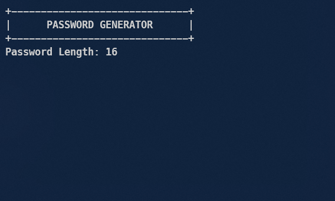
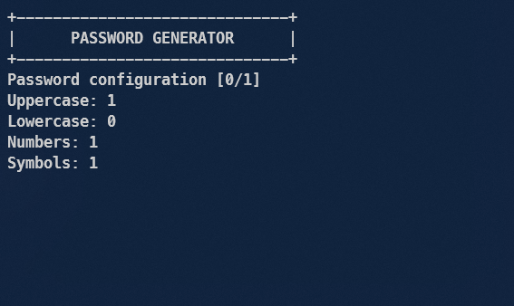
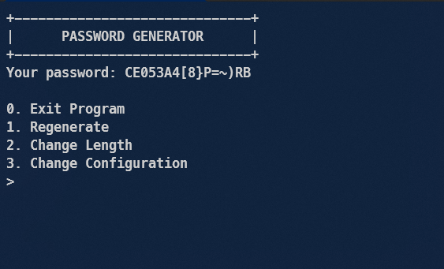
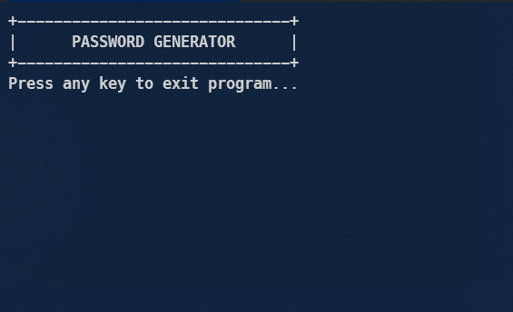

# Password Generator with C

This is a simple password generator program written in C. It generates random passwords based on user-defined criteria such as length and character types (uppercase, lowercase, digits, and special characters) using the ASCII code.

## Features

- Generate passwords of any length
- Include or exclude uppercase letters
- Include or exclude lowercase letters
- Include or exclude digits
- Include or exclude special characters

## Getting Started

1. Clone the repository

```sh
git clone https://github.com/Bibbeep/password-generator.git
cd password-generator
```

2. To compile the program, use the following command in your terminal:

```sh
gcc ./main.c -o main.exe
```

3. To run the compiled program, use the following command:

```sh
./main.exe
```

## Screenshots

Here are some screenshots of the program in action:




